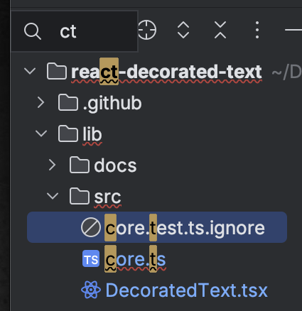

# React Decorated Text

Unstyled React component to apply multiple text highlight/decorations within a
larger body of text.

[Live demo][demo] ([Source](../web))

[demo]: https://letientai.io/react-decorated-text/


## Installation

```sh
npm i @letientai299/react-decorated-text
```

## Usage

```typescript
import DecoratedText, { match } from '@letientai299/react-decorated-text';

function Demo() {
  const text =
    'Give a man a program, and frustrate him for a day. ' +
    'Teach a man to program, frustrate him for a lifetime.';
  const decors = [
    // render to <mark>{children}</mark> by default
    ...match(text, 'man'),
    // search using regexp, render custom element that wrap the matches
    ...match(text, /p\w+m/, (p) => (
      <span style={{ color: 'red' }}>{p.children}</span>
    )),
  ];
  return <DecoratedText text={text} decors={decors} />;
}
```

`DecoratedText` takes these props:

- `text`: **required**, the body of text to display.
- `decors`: not required, list of `Decor` to be rendered within the `text`.
  Internally, the component will compute the overlap of those `decors` and
  generate the sub components
- `as`: not required, can be used to change the default HTML tag (`span`) to
  wrap the `text`.

The `match` function is just a helper to support most common use cases: search
the text for some words or a regexp and render those matches using a React
components. Its output is `Decor[]`.

For advanced use cases, instead of `match`, you might want to implement your own
function to compute `Decor[]`. Below is how `Decor` is defined (simplified).

```typescript
type Decor = {
  range: [number, number];
  render?: (props: PropsWithChildren) => ReactElement;
};
```

See the live demo source code for some example.

## Design note

This is designed to build a filterable menu, list or tree, in which the item
text are: **unstructured, immutable, can have some other overlapping
decorations**. One of such example is the project explorer in Jetbrains IDE.



This is **not** designed to work with structured text (e.g. code), or dynamic
content (inside a web-based editor). Such cases requires deeper knowledge of the
text (e.g. Abstract syntax tree, tokens), thus, requires other tools.

Some other libraries, such as
[react-highlighter](https://github.com/helior/react-highlighter) and
[react-highlight-words](https://github.com/bvaughn/react-highlight-words), only
support single match query and single style against all matches. This one is
more low level, but also more powerful:

- Can render the matches using any React element
- Can use multiple search query, or implement your own search.

That said, this design leaves the many responsibilities to you, the users:

- Make sure the searching is correct and fast
- Handle accessiblity for text segments, especially in those overlapped
  segments. This page might be helpful:
  [How to Accessibly Split Text ](https://css-irl.info/how-to-accessibly-split-text/)

## License

MIT
